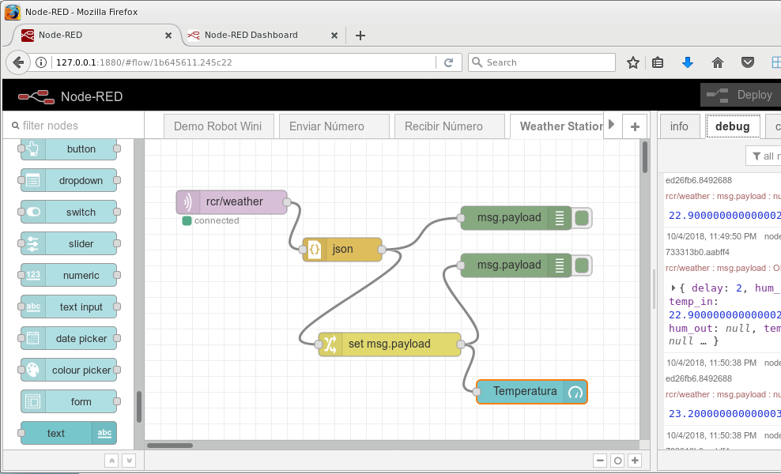

# TallerMQTT
Taller introductorio a MQTT

# Software requerido
Para poder realizar las actividades de este taller debes preparar tu computador personal con varios programas. Para esto sigue las indicaciones dadas en el documento  [Taller - 00 Instalación Software.pdf](Taller - 00 Instalación Software.pdf)

# Conceptos iniciales y motivación
Los primeros 20 minutos del taller los dedicaremos a entregarte los conceptos básicos de MQTT y, para motivarte, te mostraremos como mover un robot desde `cualquier parte del mundo`. El contenido qu te entregaremos se encuentra resumido en el documento [Taller MQTT.pdf](Taller MQTT.pdf)

Finalizado el demo realizaremos un conjunto variado de actividades para transmitir y leer información a través de la red utilizando MQTT

# Actividad: Demo de TTS
Te mostraremos como generar alertas de voz con MQTT y cualquier software TTS

# Actividad: Enviar un número
Envia un número al tópico `rcr/numero/XX`, cambiando `XX` por 01, 02, ... según te lo indiquen. El docente mostrará una página con los números que se están recibiendo.
Utiliza Node-Red, MQTT Fx y MQTT Dash para desarrollar la actividad

# Actividad:Leer una estación meteorológica
Lee los datos de la estación meteorológica que publica sus datos en el tópico `rcr/weather`. Es importante señalar que los datos son enviados en formato JSON.
Utiliza Node-Red, MQTT Fx y MQTT Dash para desarrollar la actividad

# Actividad: Transmisión y recepción de video
Lee la data que se transmitirá en el tópico `rcr/video`. Utiliza Node-Red y MQTT Dash

# Actividad: Desplegar humedad y temperatura

Construye un programa en python que lea la data, en formato JSON, trasmitida por por un nodo que manipula un sensor DHT22 (puedes visualizarla previamente con alguna otra herramienta)

# Actividad: Demo de envio de datos en Python

Este demo te mostrará como enviar datos desde Python hacia un tópico en el que espera un controlador que manipula una matriz de LEDs

# Actividad: Demo de control del Scribbler2

